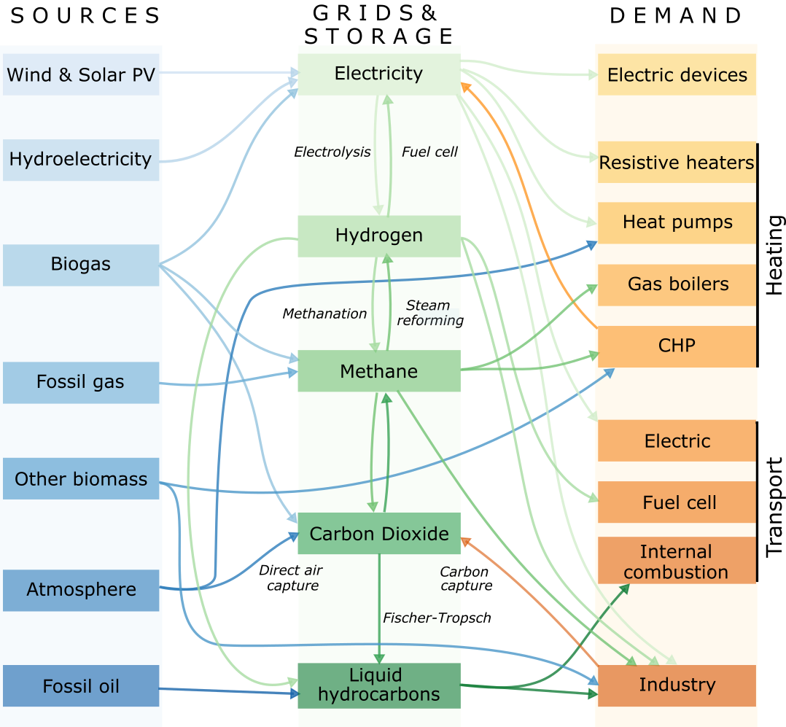

<!--
SPDX-FileCopyrightText: Contributors to PyPSA-Eur <https://github.com/pypsa/pypsa-eur>
SPDX-License-Identifier: CC-BY-4.0
-->


[](https://github.com/pypsa/pypsa-eur/actions/workflows/test.yaml)
[](https://pypsa-eur.readthedocs.io/en/latest/?badge=latest)

[](https://doi.org/10.5281/zenodo.3520874)
[](https://doi.org/10.5281/zenodo.3938042)
[](https://snakemake.readthedocs.io)
[](https://discord.gg/AnuJBk23FU)
[](https://api.reuse.software/info/github.com/pypsa/pypsa-eur)

# PyPSA-Eur: A Sector-Coupled Open Optimisation Model of the European Energy System

PyPSA-Eur is an open model dataset of the European energy system at the
transmission network level that covers the full ENTSO-E area. The model is suitable both for operational studies and generation and transmission expansion planning studies.
The continental scope and highly resolved spatial scale enables a proper description of the long-range
smoothing effects for renewable power generation and their varying resource availability.


The model is described in the [documentation](https://pypsa-eur.readthedocs.io)
and in the paper
[PyPSA-Eur: An Open Optimisation Model of the European Transmission
System](https://arxiv.org/abs/1806.01613), 2018,
[arXiv:1806.01613](https://arxiv.org/abs/1806.01613).
The model building routines are defined through a snakemake workflow.
Please see the [documentation](https://pypsa-eur.readthedocs.io/)
for installation instructions and other useful information about the snakemake workflow.
The model is designed to be imported into the open toolbox
[PyPSA](https://github.com/PyPSA/PyPSA).

**WARNING**: PyPSA-Eur is under active development and has several
[limitations](https://pypsa-eur.readthedocs.io/en/latest/limitations.html) which
you should understand before using the model. The github repository
[issues](https://github.com/PyPSA/pypsa-eur/issues) collect known topics we are
working on (please feel free to help or make suggestions). The
[documentation](https://pypsa-eur.readthedocs.io/) remains somewhat patchy. You
can find showcases of the model's capabilities in the Joule paper [The potential
role of a hydrogen network in
Europe](https://doi.org/10.1016/j.joule.2023.06.016), another [paper in Joule
with a description of the industry
sector](https://doi.org/10.1016/j.joule.2022.04.016), or in [a 2021 presentation
at EMP-E](https://nworbmot.org/energy/brown-empe.pdf). We do not recommend to
use the full resolution network model for simulations. At high granularity the
assignment of loads and generators to the nearest network node may not be a
correct assumption, depending on the topology of the underlying distribution
grid, and local grid bottlenecks may cause unrealistic load-shedding or
generator curtailment. We recommend to cluster the network to a couple of
hundred nodes to remove these local inconsistencies. See the discussion in
Section 3.4 "Model validation" of the paper.


The dataset consists of:

- A grid model based on a modified [GridKit](https://github.com/bdw/GridKit)
  extraction of the [ENTSO-E Transmission System
  Map](https://www.entsoe.eu/data/map/). The grid model contains 7072 lines
  (alternating current lines at and above 220kV voltage level and all high
  voltage direct current lines) and 3803 substations.
- The open power plant database
  [powerplantmatching](https://github.com/PyPSA/powerplantmatching).
- Electrical demand time series from the
  [OPSD project](https://open-power-system-data.org/).
- Renewable time series based on ERA5 and SARAH, assembled using the [atlite tool](https://github.com/PyPSA/atlite).
- Geographical potentials for wind and solar generators based on land use (CORINE) and excluding nature reserves (Natura2000) are computed with the [atlite library](https://github.com/PyPSA/atlite).

A sector-coupled extension adds demand
and supply for the following sectors: transport, space and water
heating, biomass, industry and industrial feedstocks, agriculture,
forestry and fishing. This completes the energy system and includes
all greenhouse gas emitters except waste management and land use.

This diagram gives an overview of the sectors and the links between
them:



Each of these sectors is built up on the transmission network nodes
from [PyPSA-Eur](https://github.com/PyPSA/pypsa-eur):


For computational reasons the model is usually clustered down
to 50-200 nodes.

Already-built versions of the model can be found in the accompanying [Zenodo
repository](https://doi.org/10.5281/zenodo.3601881).

# Technical Bounds Policy

PyPSA-Eur has been updated with realistic technical bounds for all major components to improve model stability, engineering realism, and policy relevance. This policy replaces previous infinite (`.inf`) values with evidence-based upper limits derived from existing infrastructure and technical literature.

## Rationale

**Why realistic bounds matter:**
- **Numerical Stability**: Prevents unrealistic capacity allocation during optimization
- **Engineering Realism**: Ensures solutions reflect practical deployment constraints
- **Policy Relevance**: Results align with real-world infrastructure planning capabilities
- **Model Validation**: Facilitates comparison with actual energy system development

## Implemented Bounds

### AC Transmission Lines (`lines`)
- **Capacity Limit**: 4,000 MW per line
- **Basis**: Double-circuit 380 kV line thermal ratings
- **Sources**: ENTSO-E TYNDP 2022, German grid development plans

### HVDC Links (`links`)
- **Capacity Limit**: 6,000 MW per link
- **Basis**: Bipolar HVDC technology limits (NordLink/SuedOstLink scale)
- **Sources**: ENTSO-E infrastructure data, major European HVDC projects

### Generator Capacity Limits
| Technology | Limit (MW) | Basis |
|------------|------------|-------|
| Nuclear | 1,650 | EPR reactor scale (Flamanville-3) |
| Coal/Lignite | 1,100 | Largest German units (Neurath, Niederaussem) |
| CCGT | 850 | Large European combined-cycle units |
| Onshore Wind | 500 | Large wind farm projects (Markbygden scale) |
| Offshore Wind AC | 1,200 | Large offshore projects with AC transmission |
| Offshore Wind DC | 1,400 | Future large projects with HVDC |
| Solar PV | 800 | Largest European utility-scale projects |
| Pumped Hydro | 1,800 | Largest European installations |

### Storage System Limits
| Technology | Power (MW) | Energy (MWh) | Duration |
|------------|------------|--------------|----------|
| Battery | 2,000 | 10,000 | ~5 hours |
| Pumped Hydro | 1,800 | 25,000 | ~14 hours |
| Compressed Air | 500 | 12,000 | ~24 hours |
| Hydrogen | 500 | 2,000,000 | ~4,000 hours |
| Iron-Air | 200 | 2,000 | ~10 hours |
| Vanadium Redox | 100 | 1,000 | ~10 hours |

## Configuration Management

The bounds are managed through YAML anchors in `config/config.default.yaml` for maintainability:

```yaml
lines:
  s_nom_max: &line_capacity_limit 4000  # MW
  max_extension: *line_capacity_limit

links:
  p_nom_max: &link_capacity_limit 6000  # MW  
  max_extension: *link_capacity_limit
```

## Adjusting Bounds for Future Studies

### 1. Technology Evolution
Update bounds as technologies advance:
- Monitor largest operational units globally
- Track technology vendor specifications
- Consider demonstration project outcomes

### 2. Regional Adaptation
Adjust for different study regions:
- Account for local grid codes and standards
- Consider geographical constraints
- Reflect regulatory frameworks

### 3. Scenario Analysis
Use different bound scenarios:
- **Conservative**: Current technology limits
- **Progressive**: Expected near-term advances
- **Breakthrough**: Theoretical technology potential

### 4. Validation Workflow
After changing bounds, always run validation:
```bash
python sanity_check_bounds.py
```

This script verifies:
- No unmet load in solutions
- Reasonable capacity utilization
- Components respect technical bounds
- Solutions remain feasible

## Documentation Files

- **Implementation Summary**: `CONFIGURATION_BOUNDS_UPDATE.md`
- **Technical Justification**: `technical_limits_summary.md`
- **Audit Record**: `bounds_audit_table.md`
- **Validation Script**: `sanity_check_bounds.py`

## References

1. ENTSO-E Ten-Year Network Development Plan 2022
2. BNetzA Grid Development Plan 2035 (Netzentwicklungsplan)
3. IAEA Power Reactor Information System (PRIS)
4. IRENA Global Energy Storage Roadmap 2030
5. Wind Europe Statistics and Outlook Reports
6. IEA Energy Storage Monitor
7. European transmission system operators' transparency data

---

**Note**: These bounds represent technically feasible upper limits for individual components. Actual deployment in optimization results will be constrained by economic factors, policy frameworks, and resource availability.

# Contributing and Support
We strongly welcome anyone interested in contributing to this project. If you have any ideas, suggestions or encounter problems, feel invited to file issues or make pull requests on GitHub.
-   To **discuss** with other PyPSA users, organise projects, share news, and get in touch with the community you can use the [Discord server](https://discord.gg/AnuJBk23FU).
-   For **bugs and feature requests**, please use the [PyPSA-Eur Github Issues page](https://github.com/PyPSA/pypsa-eur/issues).

# Licence

The code in PyPSA-Eur is released as free software under the
[MIT License](https://opensource.org/licenses/MIT), see [`doc/licenses.rst`](doc/licenses.rst).
However, different licenses and terms of use may apply to the various
input data, see [`doc/data_sources.rst`](doc/data_sources.rst).
